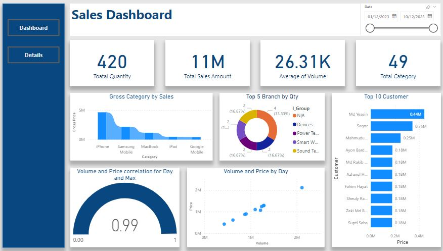
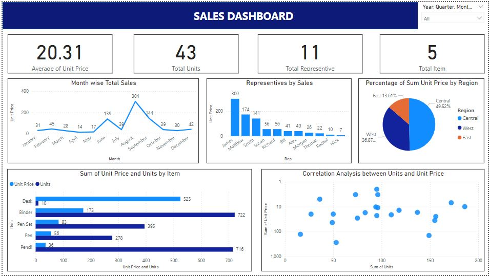

# Power BI Dashboard

## Sales Dashboard

# Dashboard Description
This dashboard serves as a comprehensive tool for tracking sales performance. It provides a high-level view of critical metrics, enabling users to quickly identify trends, high-performing products, and valuable customers. With its interactive elements, users can drill down into specific time periods and categories, making it an effective tool for data-driven decision-making. The use of diverse visualizations ensures complex data is presented clearly and intuitively.

# Features
1. Key Performance Indicators (KPIs):
Total Quantity (420): Displays the total number of products sold.
Total Sales Amount (11M): Shows the total revenue generated.
Average of Volume (26.31K): Represents the average sales volume.
Total Category (49): Indicates the total number of product categories.
2. Gross Category by Sales (Bar Chart):
This chart highlights sales distribution across different product categories like iPhone, Samsung Mobile, MacBook, and others.
It provides insights into which products contribute the most to overall sales.
3. Top 5 Branch by Quantity (Donut Chart):
Displays the top 5 branches based on the quantity of products sold.
Each slice represents a branch's share of total sales, allowing quick identification of high-performing locations.
4. Top 10 Customers by Sales (Horizontal Bar Chart):
Lists the top 10 customers ranked by total purchase amount.
Useful for identifying key clients who contribute significantly to the business.
5. Volume and Price Correlation (Scatter Plot):
Plots the relationship between volume and price.
The correlation coefficient of 0.99 indicates a strong positive correlation, suggesting that higher volumes lead to higher pricing or vice versa.
6. Volume and Price by Day (Line Chart):
Tracks the fluctuation of volume and price over time.
This helps in understanding sales trends and identifying peak sales periods.
7. Interactive Date Filter (Slider):
Enables users to select a specific date range for analysis.
This feature allows for time-based insights, such as analyzing sales during a promotional period.
8. Navigation Panel:
Includes buttons like Dashboard and Details for easy navigation between different sections of the report.

# Key Features
- Real-Time Data Insights: The dashboard updates dynamically based on the latest sales data.
- Interactive Filtering: Users can filter data by date range or specific categories for detailed analysis.
- User-Friendly Visuals: Clear and intuitive charts make complex data easy to interpret.
- Correlations and Trends: Provides actionable insights through metrics like correlation coefficient and sales trends over time.

## Order Salse Dashboard 2

